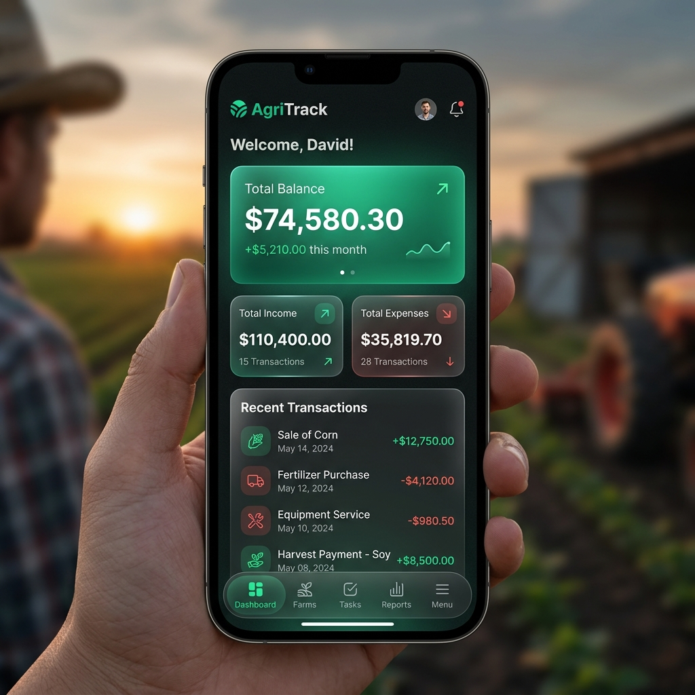

# 🌿 AgriTrack

[](https://tailwindcss.com)
[](https://developer.mozilla.org/en-US/docs/Web/JavaScript)
[](https://cordova.apache.org)

**AgriTrack** adalah platform manajemen keuangan modern yang dirancang khusus untuk membantu petani mengelola arus kas, aset, dan catatan operasional mereka dengan antarmuka yang elegan dan intuitif. Kini siap dikonversi menjadi aplikasi Android melalui Apache Cordova.

---

## ✨ Tampilan Premium


> [!TIP]
> AgriTrack menggunakan filosofi desain **Glassmorphism** dan **Modern Green Aesthetics** untuk memberikan pengalaman pengguna yang menyejukkan namun tetap profesional.

---

## 🚀 Fitur Utama

-   **📊 Dashboard Analitik**: Pantau saldo total, pemasukan, dan pengeluaran secara real-time dengan grafik yang cantik.
-   **💸 Manajemen Transaksi**: Catat setiap transaksi pertanian (pembelian pupuk, penjualan hasil panen) dengan mudah.
-   **📝 Catatan & Pengingat**: Simpan jadwal tanam, masa panen, atau catatan penting lainnya dalam satu tempat.
-   **👛 Dompet Multi-Aset**: Kelola berbagai dompet untuk memisahkan dana operasional dan dana pribadi.
-   **🌙 Mode Gelap/Terang**: Antarmuka adaptif yang nyaman dipandang baik di bawah terik matahari maupun di malam hari.

---

## 📸 Cuplikan Antarmuka

<div align="center">
  
</div>

---

## 📱 Konversi ke APK (Android)

Proyek ini telah dikonfigurasi menggunakan **Apache Cordova**. Ikuti langkah ini untuk membuat file APK:

### 1. Persyaratan Sistem
- **Node.js** & **NPM**
- **Java JDK 11** atau lebih tinggi
- **Android Studio** (dengan Android SDK & Build Tools)
- **Gradle** terpasang di PATH

### 2. Langkah-langkah Build
1.  **Instal Cordova** (jika belum):
    ```bash
    npm install -g cordova
    ```
2.  **Tambah Platform Android**:
    ```bash
    cordova platform add android
    ```
3.  **Build APK**:
    ```bash
    cordova build android
    ```
4.  **Hasil Akhir**: File `.apk` akan tersedia di `platforms/android/app/build/outputs/apk/debug/`.

---

## 🛠️ Teknologi yang Digunakan

| Komponen | Teknologi |
| :-- | :-- |
| **Mobile Framework** | Apache Cordova |
| **Styling** | Tailwind CSS v4.0 & Custom CSS |
| **Logic** | Vanilla JavaScript (ES6+) |
| **Analytics** | Chart.js |
| **Icons** | Phosphor Icons (Duotone) |

---

## 📦 Jalankan Secara Lokal (Web)

Jika ingin menjalankan versi web untuk pengembangan di browser:

1.  **Masuk ke Direktori**
    ```bash
    cd AgriTrack
    ```
2.  **Jalankan Server**
    ```bash
    npx serve www
    ```

---

## 🤝 Kontribusi

Kami sangat terbuka untuk kontribusi! Jika Anda memiliki ide untuk meningkatkan fitur atau desain AgriTrack:

1.  Fork proyek ini.
2.  Buat branch fitur baru (`git checkout -b fitur/Hebat`).
3.  Commit perubahan Anda (`git commit -m 'Menambahkan fitur Hebat'`).
4.  Push ke branch tersebut (`git push origin fitur/Hebat`).

---

<div align="center">
  <p>Dibuat dengan ❤️ untuk kemajuan Pertanian Indonesia</p>
  <a href="#main-header">Kembali ke Atas</a>
</div>
