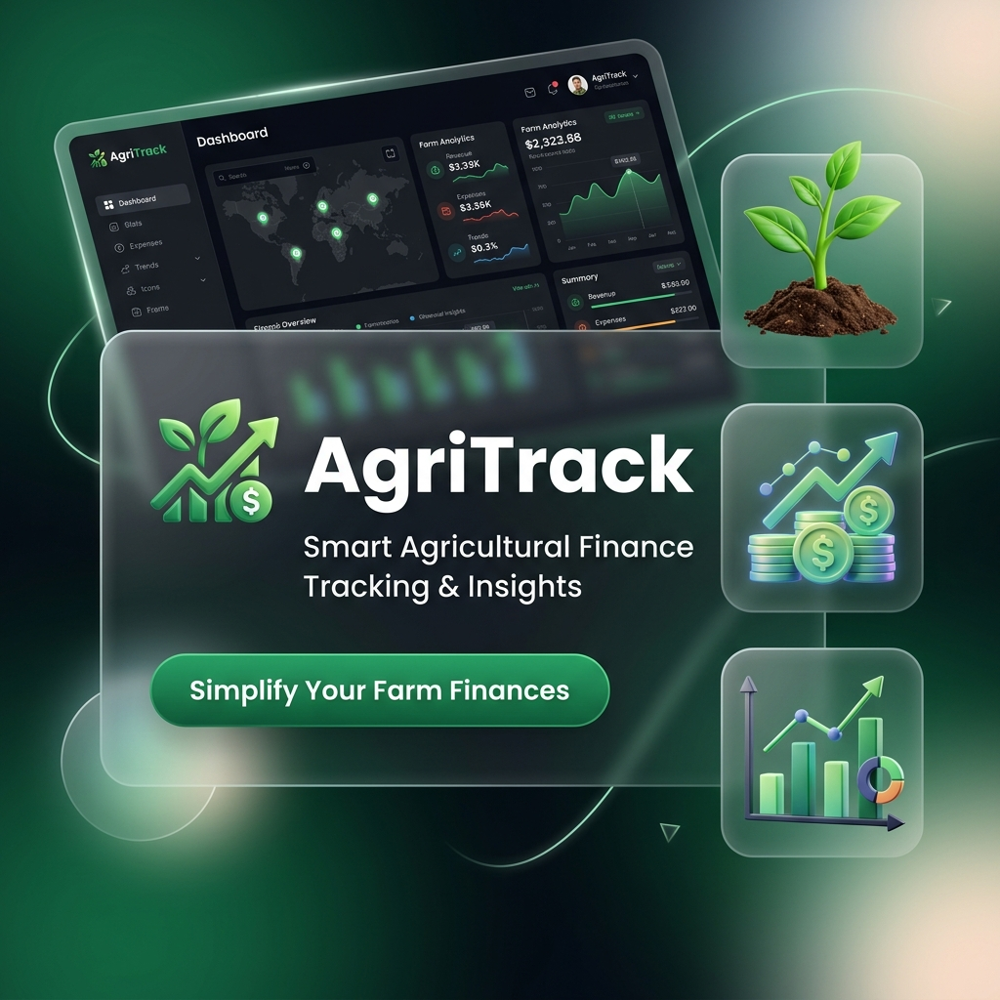

# 🌿 AgriTrack

[](https://tailwindcss.com)
[](https://developer.mozilla.org/en-US/docs/Web/JavaScript)
[](LICENSE)

**AgriTrack** adalah platform manajemen keuangan modern yang dirancang khusus untuk membantu petani mengelola arus kas, aset, dan catatan operasional mereka dengan antarmuka yang elegan dan intuitif.

---

## ✨ Tampilan Premium



> [!TIP]
> AgriTrack menggunakan filosofi desain **Glassmorphism** dan **Modern Green Aesthetics** untuk memberikan pengalaman pengguna yang menyejukkan namun tetap profesional.

---

## 🚀 Fitur Utama

-   **📊 Dashboard Analitik**: Pantau saldo total, pemasukan, dan pengeluaran secara real-time dengan grafik yang cantik.
-   **💸 Manajemen Transaksi**: Catat setiap transaksi pertanian (pembelian pupuk, penjualan hasil panen) dengan mudah.
-   **📝 Catatan & Pengingat**: Simpan jadwal tanam, masa panen, atau catatan penting lainnya dalam satu tempat.
-   **👛 Dompet Multi-Aset**: Kelola berbagai dompet untuk memisahkan dana operasional dan dana pribadi.
-   **🌙 Mode Gelap/Terang**: Antarmuka adaptif yang nyaman dipandang baik di bawah terik matahari maupun di malam hari.

---

## 📸 Cuplikan Antarmuka

<div align="center">
  
</div>

---

## 🛠️ Teknologi yang Digunakan

| Komponen | Teknologi |
| :-- | :-- |
| **Core Structure** | HTML5 Semantic Elements |
| **Styling** | Tailwind CSS v4.0 & Custom CSS |
| **Logic** | Vanilla JavaScript (ES6+) |
| **Icons** | Phosphor Icons (Duotone) |
| **Typography** | Plus Jakarta Sans (Google Fonts) |
| **Persistence** | LocalStorage API |

---

## 📦 Instalasi & Penggunaan

Ikuti langkah-langkah di bawah ini untuk menjalankan AgriTrack secara lokal:

1.  **Clone Repository**
    ```bash
    git clone https://github.com/aaidilakbarr/AgriTrack.git
    ```
2.  **Masuk ke Direktori**
    ```bash
    cd AgriTrack
    ```
3.  **Jalankan dengan Live Server**
    -   Jika menggunakan VS Code, klik kanan pada `index.html` dan pilih **"Open with Live Server"**.
    -   Atau gunakan perintah:
        ```bash
        npx serve .
        ```

---

## 🤝 Kontribusi

Kami sangat terbuka untuk kontribusi! Jika Anda memiliki ide untuk meningkatkan fitur atau desain AgriTrack:

1.  Fork proyek ini.
2.  Buat branch fitur baru (`git checkout -b fitur/Hebat`).
3.  Commit perubahan Anda (`git commit -m 'Menambahkan fitur Hebat'`).
4.  Push ke branch tersebut (`git push origin fitur/Hebat`).
5.  Buka Pull Request.

---

<div align="center">
  <p>Dibuat dengan ❤️ untuk kemajuan Pertanian Indonesia</p>
  <a href="#main-header">Kembali ke Atas</a>
</div>
